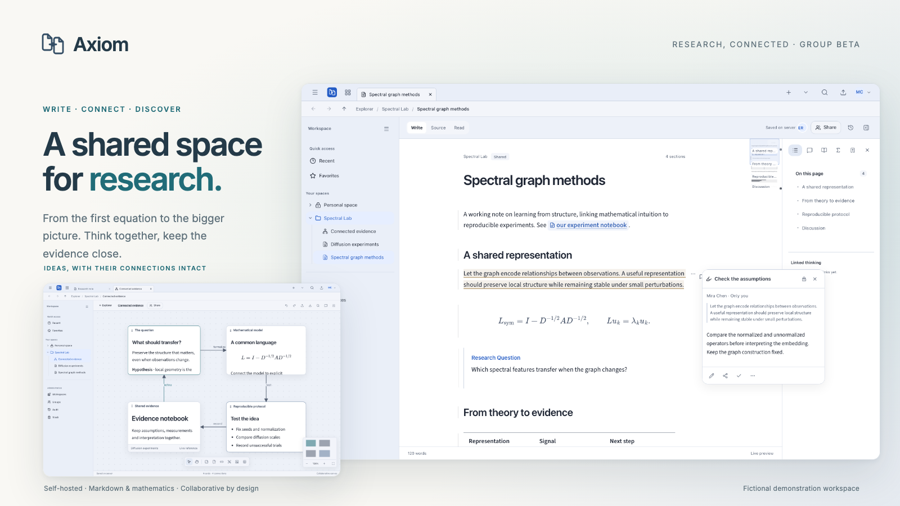

<picture>
  <source media="(prefers-color-scheme: dark)" srcset="docs/assets/showcase/banner-dark.png">
  
</picture>

# Axiom

A self-hosted research workspace for groups in AI, mathematics, physics and STEM.
Write together, connect ideas, and keep the evidence close. Markdown, mathematics,
Canvas and files share one collaborative workbench, without billing or commerce.

[Quick start](#start-locally) · [Deployment](docs/DEPLOYMENT.md) ·
[Documentation](docs/README.md) · [Showcase](docs/SHOWCASE.md) ·
[Contributing](CONTRIBUTING.md)

This is a **controlled research-group beta**, not complete Typora, Google Drive or
Photoshop parity. [Verification and release gates](docs/VERIFICATION.md) distinguish
tested workflows from remaining device, accessibility and provider checks.

## Built for research

- **Write with structure.** Collaborative Markdown, visual/source/read modes,
  display and inline LaTeX, chemistry, nested lists, tables, code, footnotes,
  citations, Mermaid and a hierarchical outline.
- **Keep the context.** Linked notes, private-first annotation cards, discussions,
  editable reading bookmarks, a configurable minimap and an image/diagram viewer.
- **Review deliberately.** Rendered/source version comparisons, named milestones,
  guarded restores, separate Markdown/math suggestions, assigned reviews and changes
  since your last visit. Image Studio adds shared cloud drafts and recovery heads.
  See [version history and review](docs/VERSION_REVIEW.md).
- **Connect the evidence.** Collaborative Canvas with rich text and file cards,
  labeled connections, embedded previews, layout controls and portable exports.
- **Plan in your workspace.** Files, tasks, milestones, discussions and reviews in
  one place. Switch between List, Board, Calendar, Gantt and Workload; preview
  dependency-aware schedule changes before applying them, with guarded Undo.
  See [workspace planning](docs/WORKSPACE_PLANNING.md).
- **Work as a group.** Invitations, roles, personal and shared workspaces, resource
  tabs, Explorer drag/move/copy, immutable file versions, Audit and independent
  workspace Trash. Group administration stays separate from workspace settings.
- **Make it yours.** Semantic light/dark themes, Paper Research and Technical Slate
  packs, separate reading/interface/code typography, device overrides and a live
  settings scratchpad.

Math Studio, layered Image Studio, Text Studio and protected media/document viewers
open files in the same workbench. Scoped OAuth/MCP integration and selected offline
work are included. Provider-assisted OCR/AI and private Office conversion stay
disabled until explicitly configured. See [feature boundaries](docs/RESEARCH_TOOLS.md)
and [offline/MCP behavior](docs/PRODUCTIVITY_PLATFORM.md).

The [PDF research workbench](docs/PDF_READER.md) adds continuous/facing pages,
collapsible contents, selection popups, exact text search, editable bookmarks,
private annotations, split reading and reversible page-copy organization.
Paper assistance is explicitly opt-in; the guide lists current limits and
remaining Zotero-style features.

## One document, two editing surfaces

Axiom's customized editor preserves canonical Markdown across visual/source editing.
It owns its parser, source transactions, block interactions and UI, and uses
Milkdown/ProseMirror and CodeMirror as underlying editing libraries. The current Axiom
editor is the default in both development and production. The older native engine is
an explicit rollback path—not a second user-facing product. See [the architecture and
exact dependency boundary](docs/EDITOR_VNEXT.md). Code is displayed, never executed;
this is not an end-to-end encrypted vault or an executable notebook platform.

## Start locally

Use Node.js 24 (Node 22.17 is also supported for development) and npm.

```sh
npm ci
npm run setup
npm run db:local
```

Leave PostgreSQL running. In another terminal:

```sh
npm run db:migrate
npm run admin
npm run dev
```

Open **http://localhost:8080**. `setup` preserves an existing `.env`; `admin`
creates the first owner/group without demo content. For a fresh installation,
choose your own credentials. Use invitation links to add colleagues.

If this checkout has already been explicitly reset, do not rerun admin/seed: use the
one-time local first-run flow described in [development reset and recovery](docs/DEVELOPMENT_RESET.md).
Never reset, seed or run browser mutation suites against your working research data.

The development web, sync and worker processes start together. Keep `PORT`,
`APP_URL` and `BETTER_AUTH_URL` consistent when changing ports. Do not interchange
`localhost` and `127.0.0.1`: cookie and origin boundaries are intentional.
Development output uses `.next/dev-8080`, separate from `AXIOM_DIST_DIR` production
builds. Editor rollback requires an explicit `NEXT_PUBLIC_AXIOM_EDITOR_ENGINE=native`
and a new build.

All file types open directly in resource tabs under `/workbench`: notes, Canvas,
math, images, text and media/document views. Explorer's New menu creates them
together. There is no separate Tools landing or creation tab; old links redirect.
See [file-first navigation](docs/FILE_WORKBENCH.md).

## Deployment

The primary path is **Docker Compose on one Linux host**, with Caddy HTTPS,
PostgreSQL 16, web, one sync service and a background worker.

```sh
cp .env.production.example .env.production
chmod 600 .env.production
# Edit the origin and replace every secret placeholder before continuing.
docker compose --env-file .env.production config --quiet
docker compose --env-file .env.production build db web
docker compose --env-file .env.production up -d
docker compose --env-file .env.production exec web node --import tsx scripts/ops/admin.ts
```

Read [deployment, backups and upgrades](docs/DEPLOYMENT.md) before using real data.
Production configuration never loads the development `.env` into containers.
Only HTTPS/HTTP are public. Sync also binds to host loopback for an
[existing host Nginx proxy](docs/DEPLOYMENT.md#existing-host-nginx); database and sync
internal APIs must not be exposed to the internet.
Native Linux/systemd installation is a [secondary option](docs/NATIVE_DEPLOYMENT.md).
No cloud deployment, image publication or external service configuration is implied.

## Verification and maintenance

```sh
npm run typecheck
npm run lint
npm test
npm run validate:themes
npm run docs:check
npm run brand:build        # regenerate the shared logo and installed-app icons
npm run clean:generated     # inventory only; add --apply after review
```

Build separately from a running release and run browser mutation tests only in an
isolated deployment. [Verification](docs/VERIFICATION.md) distinguishes fresh evidence
from historical runs and lists remaining device/provider gates.
[Contributing](CONTRIBUTING.md) explains project structure and change contracts;
[maintenance](docs/MAINTENANCE.md) explains safe cleanup and regeneration.

Private configuration, databases, attachments, backups, caches and raw test reports
stay outside Git. Only reviewed, fictional [showcase assets](docs/SHOWCASE.md) are
committed. The [brand guide](docs/BRANDING.md) and [theme authoring criteria](docs/THEME_AUTHORING.md)
keep future visual work consistent. Third-party licenses remain with their assets;
this documentation does not introduce a new project license.

A server database backup without its matching stored files is not a complete
recovery plan. Always rehearse recovery before relying on the deployment.
