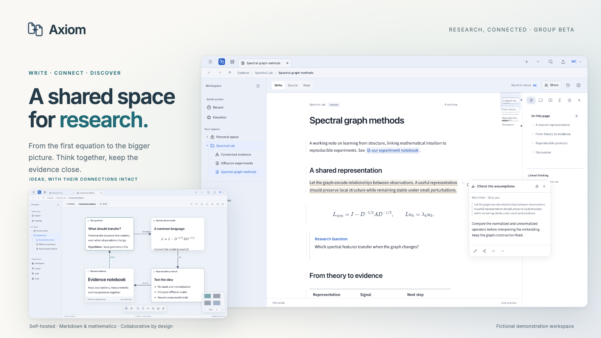
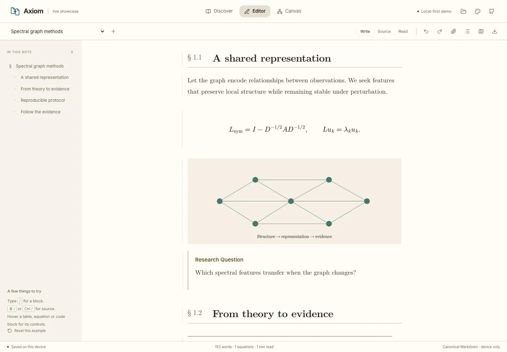
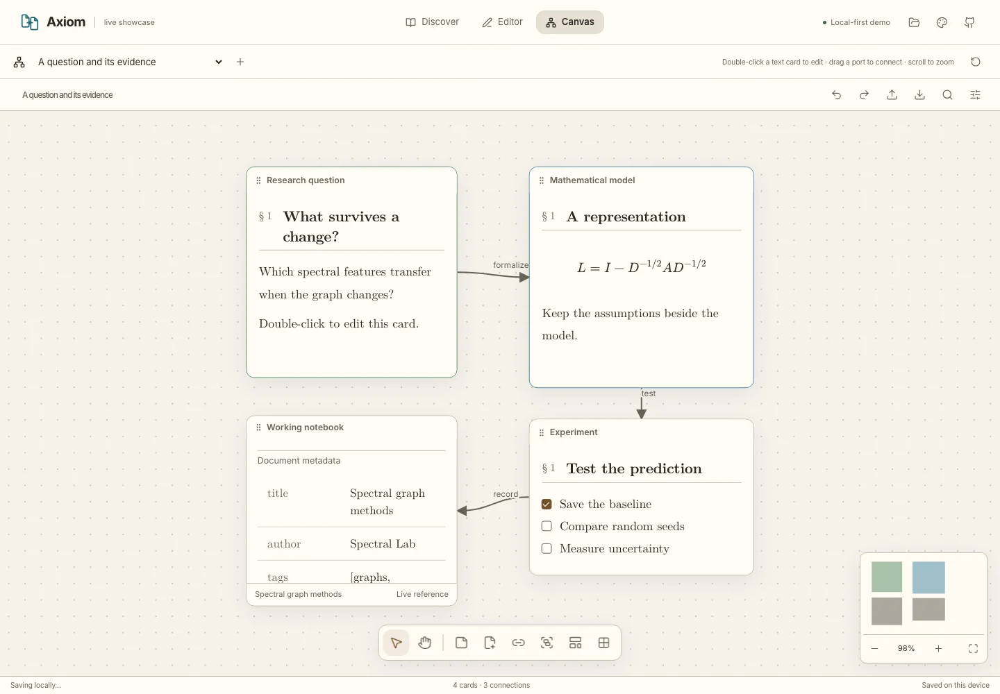
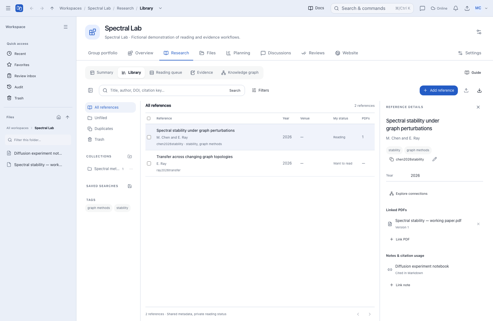
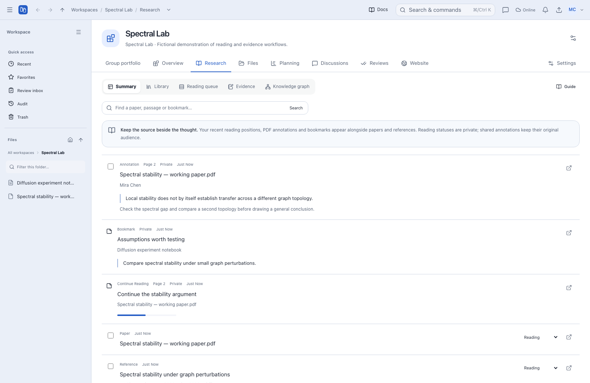
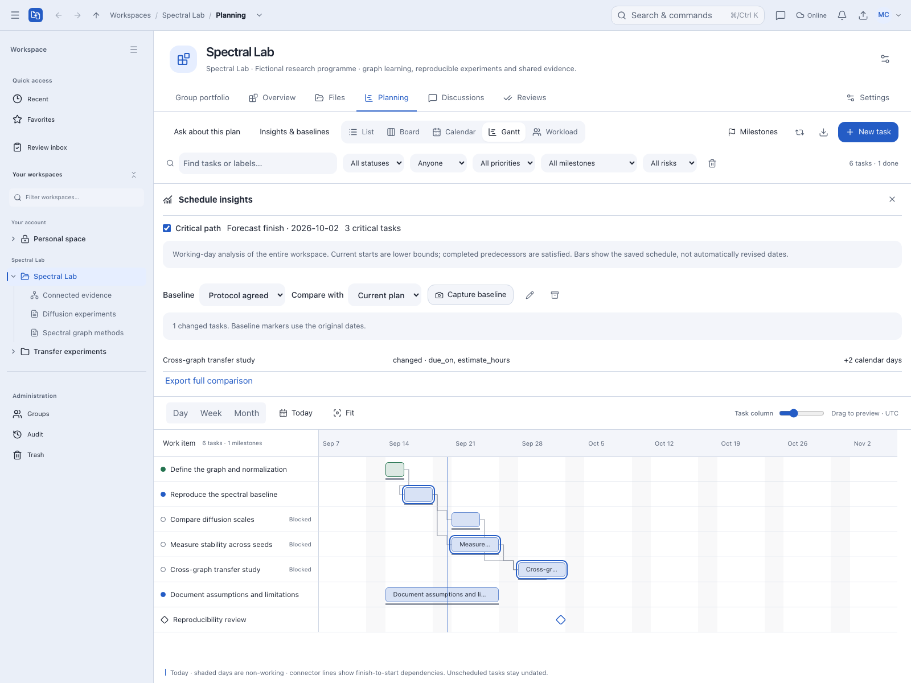

<picture>
  <source media="(prefers-color-scheme: dark)" srcset="docs/assets/showcase/banner-dark.png">
  
</picture>

# Axiom

A self-hosted research workspace for groups in AI, mathematics, physics and STEM.
Write together, plan the work, and keep the evidence close. Markdown, mathematics,
Canvas, files and research planning share one collaborative workbench, without
billing or commerce.

[Quick start](#start-locally) · [Deployment](docs/DEPLOYMENT.md) ·
[Documentation](docs/README.md) · [Live editor & Canvas](https://moleculez.github.io/axiom-notepad/) · [Showcase](docs/SHOWCASE.md) ·
[Contributing](CONTRIBUTING.md)

This is a **controlled research-group beta**, not complete Typora, Google Drive or
Photoshop parity. [Verification and release gates](docs/VERIFICATION.md) distinguish
tested workflows from remaining device, accessibility and provider checks.

## Built for research

**Try it without an account:** the [interactive showcase](https://moleculez.github.io/axiom-notepad/)
runs the actual editor and Canvas entirely in your browser, with local drafts,
uploads, themes and portable exports. Cloud collaboration and account features
belong to the self-hosted application, not the static demo.
[Open the editor](https://moleculez.github.io/axiom-notepad/#editor&note=3f000000-0000-4000-8000-000000000001)
or [explore Canvas](https://moleculez.github.io/axiom-notepad/#canvas&note=3f000000-0000-4000-8000-000000000002).
Appearance groups seven categories beside a persistent live preview, with
category-only resets and a separate local backup/import panel. Downloads include
Markdown, styled HTML, Print / Save PDF, Canvas images and portable ZIP backups.
See [showcase storage, settings and GitHub Pages deployment](docs/STATIC_SHOWCASE.md).

<picture>
  <source media="(prefers-color-scheme: dark)" srcset="docs/assets/showcase/static-editor-dark.webp">
  
</picture>

<picture>
  <source media="(prefers-color-scheme: dark)" srcset="docs/assets/showcase/static-canvas-dark.webp">
  
</picture>

- **Learn in place.** Docs beside Search & commands provides 31 searchable guides,
  your current keyboard shortcuts, and disposable examples using the real editor
  and Canvas engine. No example creates or synchronizes a file.
- **Turn reading into a draft.** The [evidence workbench](docs/PRODUCT_GUIDE.md)
  combines reading positions, standalone-PDF reading statuses, references,
  annotations and bookmarks. Select evidence, preview a linked research note or
  Canvas, and explicitly approve creation. Private-to-shared copies require
  acknowledgement; source revisions and permissions are rechecked.
- **Organize and connect sources.** Every workspace has a Research tab between
  Overview and Files: Summary, Library, Reading queue, Evidence and Knowledge
  graph. Independent workspace libraries support nested
  collections, tags, private reading status, reviewed BibTeX/RIS imports, bulk
  actions and reversible trash. Duplicate merges preserve citation keys. Explore
  explicit note, reference and PDF connections with an interactive, exportable graph.
  Restricted workspaces retain their own content permissions and bibliography.
- **Write with structure.** Collaborative Markdown, visual/source/read modes,
  display and inline LaTeX, chemistry, nested lists, tables, code, footnotes,
  citations, Mermaid and a hierarchical outline.
- **Keep the context.** Linked notes, private-first annotation cards, discussions,
  editable reading bookmarks, a configurable minimap and an image/diagram viewer.
- **Insert research evidence.** A preview-first file picker, smart uploads,
  numbered figures and captions, PDF quotations, timestamped media, CSV excerpts,
  stable workspace file codes, attachment checks, and reusable research snippets.
  See [editor media workflows](docs/EDITOR_MEDIA.md).
- **Read and share cleanly.** Focused Read mode and snapshot-based exports to
  styled HTML, Print / Save PDF, Markdown and Markdown-with-assets ZIP, with
  embedded fonts, equations and diagrams. See [document export](docs/DOCUMENT_EXPORT.md).
- **Publish reviewed research.** Each workspace can create a personal or team
  [website](docs/WORKSPACE_WEBSITES.md): four layouts, seven visual themes (including
  LaTeX Paper), floating TOC, reading statistics, topics, timeline archives, private
  author analytics, read-only research viewers and portable static ZIPs.
  Editors prepare frozen previews; managers approve publication. Private edits
  stay private. Optional verified custom domains use the supplied Caddy deployment.
- **Review deliberately.** Rendered/source version comparisons, named milestones,
  guarded restores, separate Markdown/math suggestions, assigned reviews and changes
  since your last visit. Image Studio adds shared cloud drafts and recovery heads.
  See [version history and review](docs/VERSION_REVIEW.md).
- **Connect the evidence.** Collaborative Canvas with rich text and file cards,
  labeled connections, embedded previews, layout controls and portable exports.
- **Ask with evidence.** An opt-in [workspace research assistant](docs/WORKSPACE_ASSISTANT.md)
  with selected excerpts, exact outgoing-context review, source citations, private
  Markdown/math suggestions and reviewed task/schedule changes with guarded Undo.
  Select evidence across workspaces in one group, including Office excerpts,
  Canvas cards and planning snapshots; nothing is sent without context review.
- **Plan in your workspace.** Files, tasks, milestones, discussions and reviews in
  one place. Switch between List, Board, Calendar, Gantt and Workload; preview
  dependency-aware schedule changes before applying them, with guarded Undo.
  Group portfolios, immutable baselines, critical-path/slack overlays and weekly
  estimate-based capacity connect the individual workspace plans.
  See [workspace planning](docs/WORKSPACE_PLANNING.md).
  Planning also includes linked/manual Goals, member-only research Intake,
  searchable paginated request/decision archives with lazy full-body loading,
  recurring templates/history, private/shared saved views, bulk changes,
  signed working-day dependency offsets, Quarter/Year timelines and enriched
  CSV/SVG/print exports. Capacity previews include accessible group commitments;
  AI/MCP changes still require explicit review.
- **Work as a group.** Invitations, roles, personal and shared workspaces, a compact
  context toolbar with pinned recent work, Explorer drag/move/copy, immutable file
  versions, Audit and independent workspace Trash. Group administration stays
  separate from workspace settings.
  A theme-aware toolbar progress bar handles loading without replacing already
  loaded panels; quick requests stay quiet and reduced motion uses a static line.
- **Bring your notes with you.** [Import Markdown, folders or ZIP collections](docs/WORKSPACE_IMPORTS.md)
  from Files → Add files. Review local Preview/Source, hierarchy and matching names;
  Markdown becomes editable collaborative notes and supporting files retain their
  folders. Relative links resolve to imported identities without reformatting the
  source. Private resumable preparation publishes the whole collection atomically,
  never overwrites originals, and stays recoverable in Activity & recovery.
- **Extend deliberately.** An opt-in [extension platform](docs/EXTENSIONS.md) with
  a TypeScript SDK, immutable packages, native themed panels, exact group approval
  and individual workspace consent. Research Journal, Document Health and Planning
  Brief run in isolated workers; changes use the existing human-reviewed pipeline.
  Installation starts disabled; third-party imports have a separate default-off
  gate. Updates, configuration rollback, revocation, safe mode and activity are included.
  Search & commands shares active-pane context and one retained inspector slot.
  Toolbar Activity & recovery opens existing upload/file/export/OCR/assistant
  controllers without automatically retrying work.
- **Make it yours.** Semantic light/dark themes, Paper Research and Technical Slate
  packs, separate reading/interface/code typography, device overrides and a live
  settings scratchpad. Axiom, Material Tonal, Fluent Studio, Editorial and macOS Studio component
  styles change controls and surfaces independently of your colors and reading fonts.
  Settings has a searchable grouped rail and a consistent page frame.
  Shared native controls and an interactive Interface specimen keep settings,
  action bars and dialogs consistent. Reusable field shells align icons, labels
  and clear actions without nested borders. See [UI criteria](docs/UI_CONTROLS.md).

Math Studio, layered Image Studio, Text Studio and protected media/document viewers
open files in the same workbench. Scoped OAuth/MCP integration and selected offline
work are included. Provider-assisted OCR/AI and private Office conversion stay
disabled until explicitly configured. See [feature boundaries](docs/RESEARCH_TOOLS.md)
and [offline/MCP behavior](docs/PRODUCTIVITY_PLATFORM.md).

The [PDF research workbench](docs/PDF_READER.md) adds continuous/facing pages,
collapsible contents, selection popups, exact text search, editable bookmarks,
tagged multi-page annotations, drawing tools, annotation discussions/bulk actions,
virtualized pages, file/version comparison, reading-position resume and guarded
workspace copies with annotation mapping. Link an annotation to a task without
copying private text, and recover unsent discussion replies on the current device.
Optional [self-hosted CPU OCR](docs/SELF_HOSTED_OCR.md)
adds reviewed research text and searchable PDF copies; real-container acceptance
remains gated. Read-only Office viewers add
styled worksheet grids, Word reading outlines and PowerPoint speaker notes.
Paper assistance is explicitly opt-in; the guide lists current limits and
remaining Zotero-style features.
The [productivity roadmap](docs/PRODUCTIVITY_ROADMAP.md) separates this increment
from remaining provider acceptance, planning refinements and team-operation stages.

## From evidence to a reviewed plan

<picture>
  <source media="(prefers-color-scheme: dark)" srcset="docs/assets/showcase/research-library-dark.png">
  
</picture>

<picture>
  <source media="(prefers-color-scheme: dark)" srcset="docs/assets/showcase/research-dark.png">
  
</picture>

Open **Docs** beside Search & commands to learn the workflow with safe interactive
examples. **Research** turns selected sources into a previewed note or Canvas;
the [showcase](docs/SHOWCASE.md) includes the privacy acknowledgement and exact draft.

<picture>
  <source media="(prefers-color-scheme: dark)" srcset="docs/assets/showcase/planning-dark.png">
  
</picture>

1. **Plan a study.** Add tasks, dependencies and milestones in a workspace. Capture
   a baseline, compare changes and inspect working-day critical paths and slack.
2. **Coordinate the group.** Collect workspaces into a portfolio. Review combined
   weekly effort against explicit availability; unknown capacity is never treated
   as zero. Drill into overloads before changing a schedule.
3. **Ask with a boundary.** Choose accessible workspaces in one group and select
   evidence from notes, Office files, Canvas or planning. Review exact outgoing
   context before sending. Suggested edits and schedule changes still require
   explicit review and application, with version-checked Undo.
4. **Keep the work in view.** Read and annotate papers, link evidence to tasks, and
   switch views without losing the workspace shell. Background refreshes retain
   content while the toolbar indicates activity.

Explore the [illustrated feature tour](docs/SHOWCASE.md#feature-tour) for portfolio,
capacity, assistant and loading views. All pictured people and research are
fictional; the assistant demonstration stops before sending anything to a provider.

Schedule previews currently show **workspace-only capacity impact**; use group
Capacity for combined commitments. Office views remain read-only, and real AI/OCR
provider acceptance is separate from the local demonstration.

## One document, two editing surfaces

Axiom's customized editor preserves canonical Markdown across visual/source editing.
It owns its parser, source transactions, block interactions and UI, and uses
Milkdown/ProseMirror and CodeMirror as underlying editing libraries. The current Axiom
editor is the default in both development and production. The older native engine is
an explicit rollback path—not a second user-facing product. See [the architecture and
exact dependency boundary](docs/EDITOR_VNEXT.md). Code is displayed, never executed;
this is not an end-to-end encrypted vault or an executable notebook platform.

## Start locally

Use Node.js 24 (Node 22.17 is also supported for development) and npm.

```sh
npm ci
npm run setup
npm run db:local
```

Leave PostgreSQL running. In another terminal:

```sh
npm run db:migrate
npm run admin
npm run dev
```

Open **http://localhost:8080**. `setup` preserves an existing `.env`; `admin`
creates the first owner/group without demo content. For a fresh installation,
choose your own credentials. Use invitation links to add colleagues.

If this checkout has already been explicitly reset, do not rerun admin/seed: use the
one-time local first-run flow described in [development reset and recovery](docs/DEVELOPMENT_RESET.md).
Never reset, seed or run browser mutation suites against your working research data.

The development web, sync and worker processes start together. Keep `PORT`,
`APP_URL` and `BETTER_AUTH_URL` consistent when changing ports. Do not interchange
`localhost` and `127.0.0.1`: cookie and origin boundaries are intentional.
Development output uses `.next/dev-8080`, separate from `AXIOM_DIST_DIR` production
builds. Editor rollback requires an explicit `NEXT_PUBLIC_AXIOM_EDITOR_ENGINE=native`
and a new build.

All file types open directly under `/workbench`: notes, Canvas,
math, images, text and media/document views. Explorer's New menu creates them
together. There is no separate Tools landing or creation tab; old links redirect.
Back/Forward traverses pages; Recent work restores views without a tab strip.
Use `⌘/Ctrl K` for search and commands, or `⌘/Ctrl Alt R` for Recent work.
See [file-first navigation](docs/FILE_WORKBENCH.md).

## Deployment

The primary path is **Docker Compose on one Linux host**, with Caddy HTTPS,
PostgreSQL 16, web, one sync service, a background worker and an independent public
website reader.

```sh
cp .env.production.example .env.production
chmod 600 .env.production
# Edit the origin and replace every secret placeholder before continuing.
docker compose --env-file .env.production config --quiet
docker compose --env-file .env.production build db web
docker compose --env-file .env.production up -d
docker compose --env-file .env.production exec web node --import tsx scripts/ops/admin.ts
```

Read [deployment, backups and upgrades](docs/DEPLOYMENT.md) before using real data.
Current features require database migrations through **43**, including workspace
research/planning, controlled extensions, searchable Intake and atomic imports.
Back up database and stored files, stop old writers, migrate, and restart matching
web/sync/worker/publish versions; do not mix old services with the new schema.
Production configuration never loads the development `.env` into containers.
Only HTTPS/HTTP are public. Sync also binds to host loopback for an
[existing host Nginx proxy](docs/DEPLOYMENT.md#existing-host-nginx); database and sync
internal APIs must not be exposed to the internet.
Native Linux/systemd installation is a [secondary option](docs/NATIVE_DEPLOYMENT.md).
No cloud deployment, image publication or external service configuration is implied.

## Verification and maintenance

```sh
npm run typecheck
npm run lint
npm test
npm run validate:themes
npm run validate:ui
npm run docs:check
npm run brand:build        # regenerate the shared logo and installed-app icons
npm run clean:generated     # inventory only; add --apply after review
```

Build separately from a running release and run browser mutation tests only in an
isolated deployment. [Verification](docs/VERIFICATION.md) distinguishes fresh evidence
from historical runs and lists remaining device/provider gates.
[Contributing](CONTRIBUTING.md) explains project structure and change contracts;
[maintenance](docs/MAINTENANCE.md) explains safe cleanup and regeneration.

Private configuration, databases, attachments, backups, caches and raw test reports
stay outside Git. Only reviewed, fictional [showcase assets](docs/SHOWCASE.md) are
committed. The [brand guide](docs/BRANDING.md) and [theme authoring criteria](docs/THEME_AUTHORING.md)
keep future visual work consistent. Third-party licenses remain with their assets;
this documentation does not introduce a new project license.

A server database backup without its matching stored files is not a complete
recovery plan. Always rehearse recovery before relying on the deployment.
