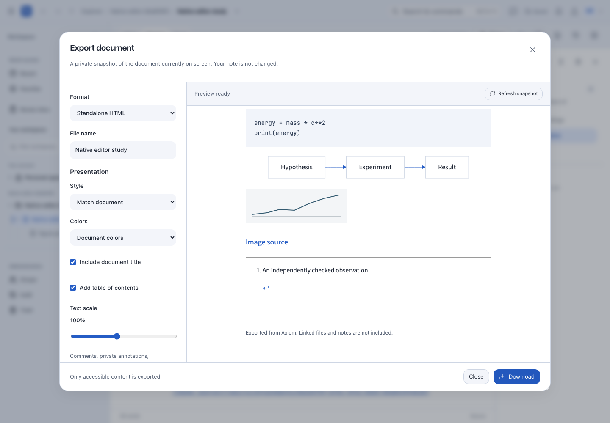
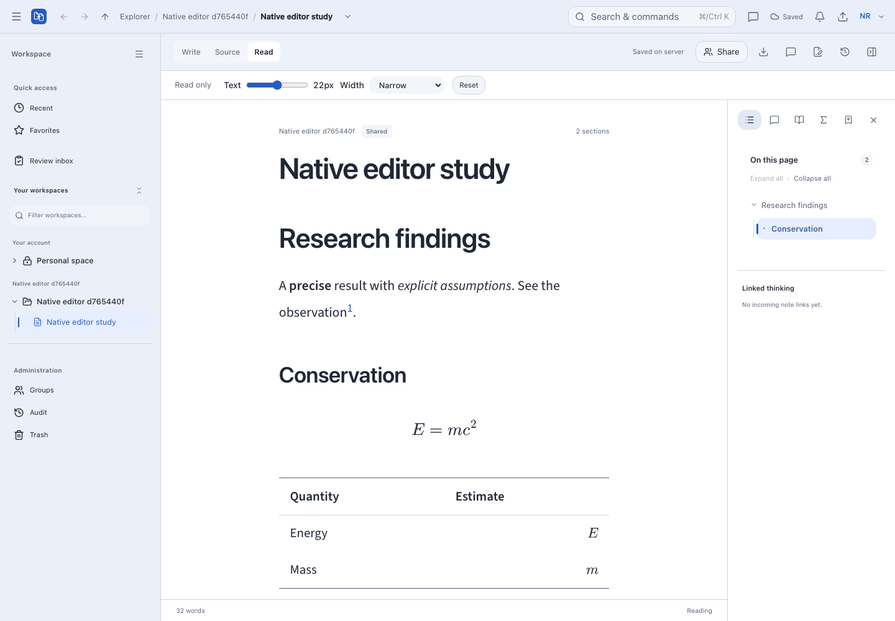

# Document export and focused reading

Open a Markdown note and choose **Export document** in its toolbar, or find
**Export document** in Search & commands. Export is available to readers as well
as editors; it does not grant access to other notes or files.



The captures in this guide use a disposable research test document, not working
research data.

## Choose a format

| Format                  | What it contains                                                                                                                                   |
| ----------------------- | -------------------------------------------------------------------------------------------------------------------------------------------------- |
| Standalone HTML         | Script-free document, embedded fonts and authorized raster images, rendered math and supported Mermaid SVG, tables, tasks, footnotes and citations |
| Print / Save as PDF     | The same prepared document on light paper, using the browser's print dialog; ordinary text remains selectable                                      |
| Markdown source         | The exact source snapshot, without presentation settings or bundled files                                                                          |
| Markdown + assets (ZIP) | That same source snapshot, accessible referenced file versions and bibliography, with relative attachment links                                    |

**Match document** retains your typography and section decorations. **Academic**
uses Latin Modern with LaTeX-style headings; **Minimal** uses restrained sans-serif
typography. HTML can retain document colors or use light paper. PDF uses light
paper even when the application is dark.

You can change the filename, include or hide the document title, add a contents
list and adjust text scale. PDF supports A4/Letter, portrait/landscape and 8–40 mm
margins. In the browser dialog choose **Save as PDF** and turn off browser headers
and footers. The embedded preview shows document styling; the native print preview
shows final page breaks. Printer/browser settings can override CSS page setup.
External links open from the downloaded HTML, not inside the print preview.

## Snapshot and access boundaries

Opening Export captures the source currently on screen, including local edits.
Later collaboration changes do not silently replace that snapshot. A notice and
**Refresh snapshot** let you explicitly include newer edits. Export preparation
does **not** save, overwrite or publish the submitted snapshot as a note revision.

The preview endpoint accepts bounded source and validated presentation options,
requires current note read access, checks the note generation, and rechecks access
after rendering. Image dependencies are authorized separately. ZIP creation is
queued for the workspace worker; dependency access is checked during preparation
and again on download. Closing the dialog cancels local preview work and polling,
but a queued ZIP continues in the background. Find it under **Settings → Exports**.

No comments, private annotations, bookmarks or account details enter HTML/PDF or
the Markdown body. ZIP manifests include file/resource identifiers and file
metadata to describe the archive; treat downloaded archives as copies of the
selected research material. Revocation cannot retract a file already downloaded.

## Limits and fallbacks

- The server never fetches arbitrary image URLs. External, inaccessible and
  unsupported images become visible links/placeholders with warnings. Upload an
  image to Axiom to include it offline. PNG, JPEG, GIF and WebP are embedded; the
  combined image limit is 20 MiB. Use ZIP for large or original files.
- Embedded font licenses travel with HTML. System fonts use bundled equivalents;
  scripts outside their coverage, including some CJK text, may use device fonts.
- Unsupported/failed diagrams retain readable Mermaid source and a warning.
  Invalid equations retain their source. External diagram resources are disabled.
- Linked notes are not recursively exported. Linked PDFs/media are links in
  HTML/PDF; the Markdown ZIP can include accessible referenced attachments.
- Preview source is limited to one million UTF-16 code units. Existing archive
  storage and concurrency limits also apply. A running worker is required for ZIP.
- DOCX, LaTeX source conversion and server-side/headless-browser PDF generation
  are not part of this export feature.

## Read mode



**Read** makes the document title and body non-editable and hides formatting and
insertion actions. Source inspection remains read-only for viewers. Reading text
size and width adjustments are local to the open document session; **Reset**
returns to your saved appearance without changing preferences or the source.

The outline, minimap, bookmarks and permitted discussions/annotations remain
available. Code blocks have a hover/focus Copy button. Right-click a heading to
copy its section link. Image and Mermaid inspection use the same dedicated viewer
as the editing surface; double-click a preview to inspect it.

Unchanged rendered blocks are retained during collaboration updates, preserving
decoded images and equation/diagram DOM. If you are selecting text, incoming
render changes wait until the selection is cleared. Access revocation still
removes the document through the normal authorization boundary. The existing
collaboration session stays mounted; Read does not create a second connection.

## Contributor checks

Shared presentation is in `packages/shared/assets/document-presentation.css`;
validated options and snapshots are in `packages/shared/src/document-export.ts`.
The server preview, browser diagram preparation and isolated sandboxed frame are
separate from editor persistence. Keep script execution disabled in the frame.

Run `tests/html-export.test.ts` and `tests/e2e/document-export.spec.ts`. The browser
suite must target a dedicated staging database on port 3004; never seed the working
notebook. It emits export/read screenshots and a real Chromium-generated PDF.
Rasterize that PDF and verify text with:

```bash
npx tsx scripts/verify/document-export-pdf.ts <test-output>/research-export.pdf 'Research findings'
```

Inspect every emitted page image before treating a layout change as accepted.
Automated Chromium printing is not proof of physical-printer or native Safari/
Firefox print-dialog behavior; those remain manual device acceptance checks.
