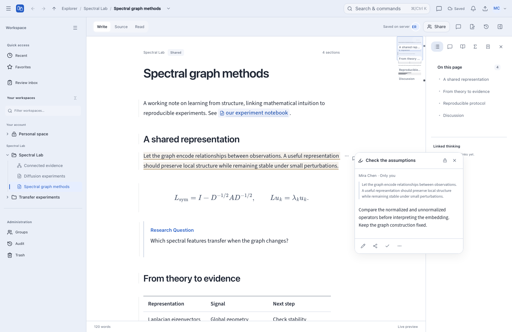
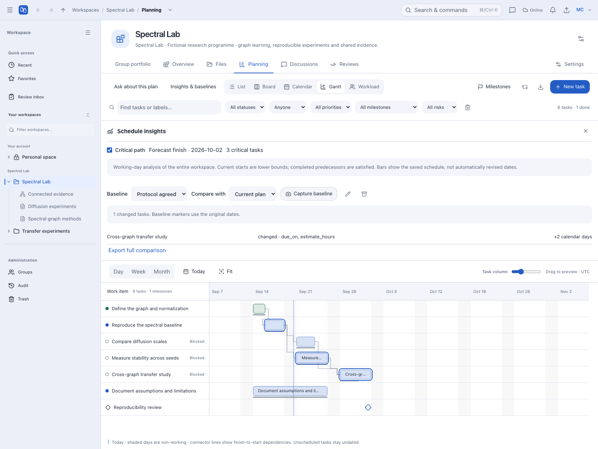
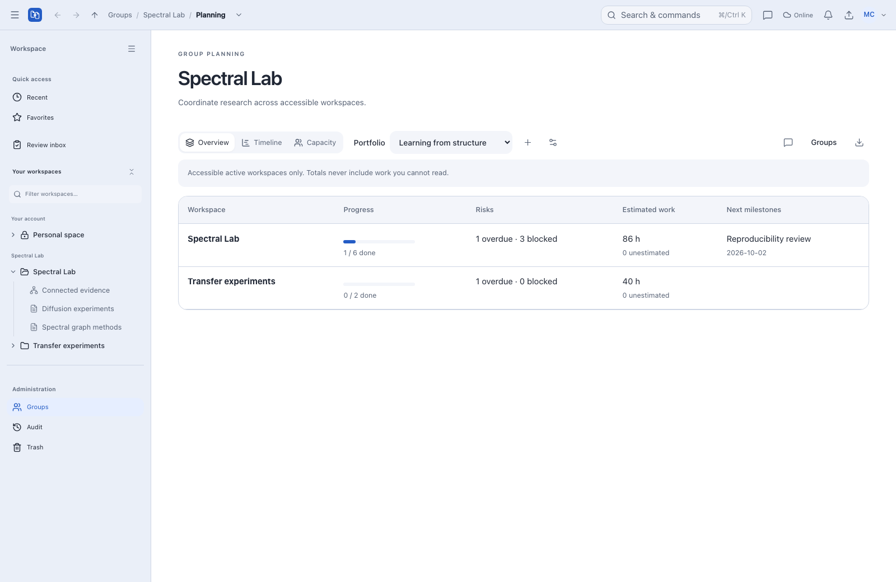
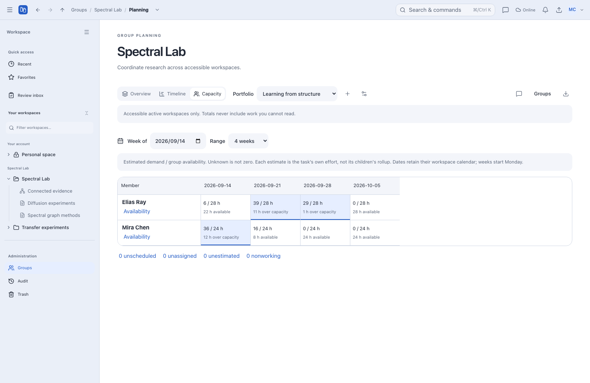
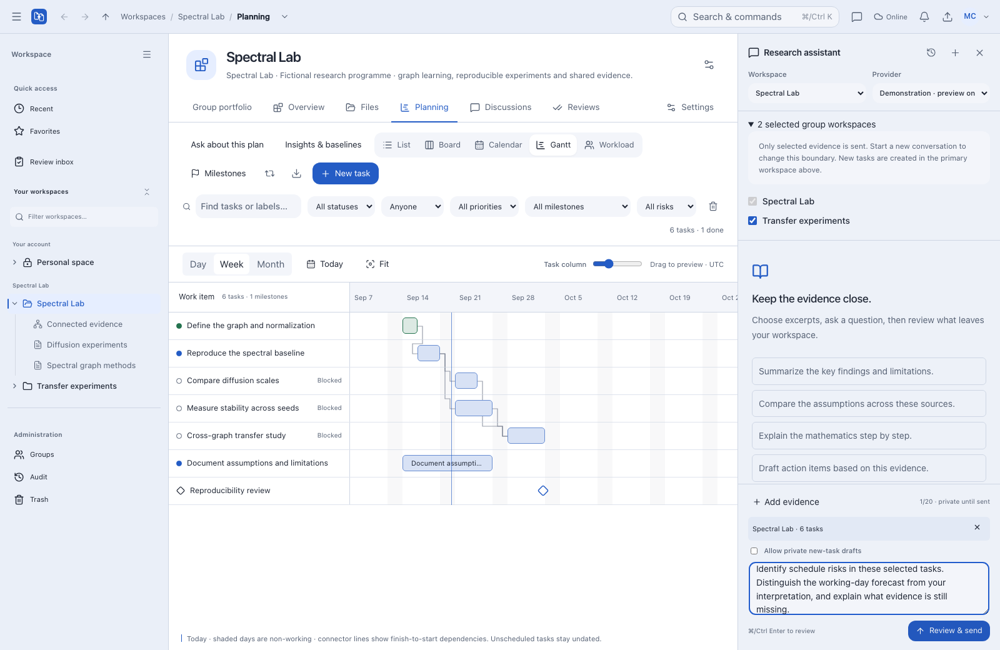
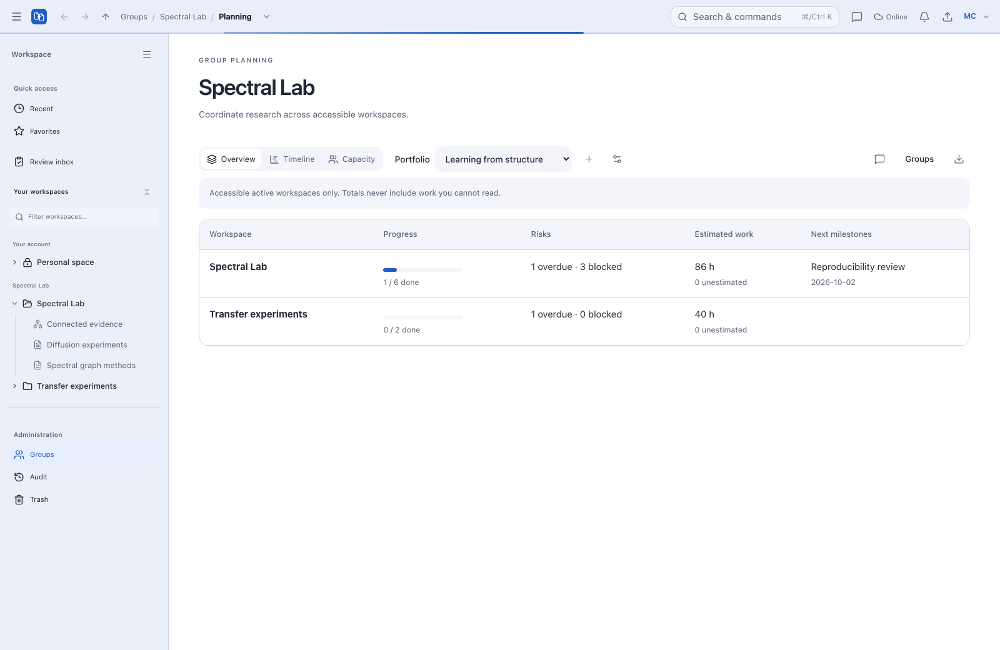

# Product showcase and asset workflow

The README and this tour show Axiom's actual workbench, populated with fictional
**Spectral Lab** research. Mira Chen, Elias Ray, their tasks, notes and annotations
are demonstration content. The gallery covers collaborative writing, Canvas,
planning, group capacity, scoped assistant context and toolbar loading feedback.
It is not a mockup or a claim of complete third-party app parity.

The assistant demonstration selects context but **does not prepare or send a
request to a provider**. Loading is captured during a deliberately delayed local response, not
a performance benchmark. Current test evidence and release gates live in
[Verification](VERIFICATION.md).

## Feature tour

### 1. Write and connect the evidence

Open a Markdown note to work with equations, structured research blocks, linked
notes and annotations. Canvas connects rich text, mathematics and file evidence
without moving them into a separate tool workspace.

<picture>
  <source media="(prefers-color-scheme: dark)" srcset="assets/showcase/editor-dark.png">
  
</picture>

See the [Canvas light](assets/showcase/canvas-light.png) and
[Canvas dark](assets/showcase/canvas-dark.png) captures, the
[editor guide](EDITOR.md) and [Canvas guide](PRODUCTIVITY_PLATFORM.md).

### 2. Compare the plan with its baseline

In **Workspace → Planning → Gantt**, open **Insights & baselines**. The fictional
study has six tasks, finish-to-start dependencies and a review milestone. Its
immutable “Protocol agreed” snapshot is compared with the current plan: one task
has a later deadline and a larger estimate. Muted baseline markers retain the
original dates; critical-path highlighting is a working-day calculation, not an
AI prediction or an automatic schedule rewrite.

<picture>
  <source media="(prefers-color-scheme: dark)" srcset="assets/showcase/planning-dark.png">
  
</picture>

Manual and assistant-proposed schedule changes use preview, explicit application
and revision-checked Undo. See [planning and baseline semantics](WORKSPACE_PLANNING.md).

### 3. Coordinate workspaces, not just individual tasks

In **Groups → Planning**, the “Learning from structure” portfolio collects two
workspaces. Overview summarizes progress, risk and estimated effort; Timeline
places workspace schedules together. Access still follows workspace permissions.

<picture>
  <source media="(prefers-color-scheme: dark)" srcset="assets/showcase/portfolio-dark.png">
  
</picture>

Switch to **Capacity** to compare weekly task estimates with each member's explicit
availability. Unknown availability and missing estimates stay visible instead of
being interpreted as zero. In this fixture, Mira has 24 available hours per week
and Elias has 28; the first week deliberately includes an overload across projects.

<picture>
  <source media="(prefers-color-scheme: dark)" srcset="assets/showcase/capacity-dark.png">
  
</picture>

This is estimate-based planning, not tracked time. Schedule-change previews
currently show **workspace-only** capacity impact; the group report is the place
to inspect combined commitments. Full cross-workspace conflict previews remain
on the [roadmap](PRODUCTIVITY_ROADMAP.md).

### 4. Ask with a visible evidence boundary

**Ask about this plan** attaches an explicit planning snapshot. Here the assistant
is scoped to two accessible workspaces in the same group;
the selected evidence contains six tasks. Adding a workspace to the scope does
not automatically send its contents.

<picture>
  <source media="(prefers-color-scheme: dark)" srcset="assets/showcase/assistant-dark.png">
  
</picture>

The next step, **Review & send**, is intended for checking exact outgoing messages
and evidence before approving transmission. This gallery stops at context selection;
it is not an acceptance test of sending or model behavior. No generated answer is
shown or implied. Office
excerpts, selected Canvas cards and planning snapshots are supported evidence;
suggestions and schedule changes require a separate review before application.
See [assistant privacy, context and provider setup](WORKSPACE_ASSISTANT.md).

### 5. Keep the workspace visible while it refreshes

A thin, theme-colored indeterminate line sits against the app toolbar. Requests,
guarded actions and lazy pages share it; short requests avoid flicker, overlapping
work settles together, and reduced motion uses a static line. Already loaded
panels stay visible during same-target refreshes.

<picture>
  <source media="(prefers-color-scheme: dark)" srcset="assets/showcase/loading-dark.png">
  
</picture>

The capture holds a real local refresh response long enough to show the line,
checks the two existing rows remain visible, and then releases the response.
It neither draws a fake indicator nor assigns an invented completion percentage.

### Also new in the PDF workflow

The [PDF reader](PDF_READER.md) can link an annotation to a planning task without
copying private annotation text. Unsent discussion replies can recover on the
same device, with a fresh access check and explicit submission. These capabilities
are documented, **not pictured in this gallery**. Real external AI and OCR
acceptance remains separate; Office viewers are read-only.

## Ready-to-use assets

| Asset                                                                                                                                | Size        | Purpose                                     |
| ------------------------------------------------------------------------------------------------------------------------------------ | ----------- | ------------------------------------------- |
| [Light banner](assets/showcase/banner-light.png) / [dark banner](assets/showcase/banner-dark.png)                                    | 1600 × 900  | README and product presentation             |
| [Social preview](assets/showcase/social-preview.png)                                                                                 | 1200 × 630  | Neutral public link preview                 |
| [Light editor](assets/showcase/editor-light.png) / [dark editor](assets/showcase/editor-dark.png)                                    | 1600 × 1040 | Actual equation-rich note and annotation UI |
| [Light Canvas](assets/showcase/canvas-light.png) / [dark Canvas](assets/showcase/canvas-dark.png)                                    | 1600 × 1040 | Actual connected cards and file evidence    |
| [Light planning](assets/showcase/planning-light.png) / [dark planning](assets/showcase/planning-dark.png)                            | 1600 × 1200 | Baseline comparison and critical-path Gantt |
| [Light portfolio](assets/showcase/portfolio-light.png) / [dark portfolio](assets/showcase/portfolio-dark.png)                        | 1600 × 1040 | Group overview across two workspaces        |
| [Light capacity](assets/showcase/capacity-light.png) / [dark capacity](assets/showcase/capacity-dark.png)                            | 1600 × 1040 | Explicit availability and weekly effort     |
| [Light assistant](assets/showcase/assistant-light.png) / [dark assistant](assets/showcase/assistant-dark.png)                        | 1600 × 1040 | Selected context before sending             |
| [Light loading](assets/showcase/loading-light.png) / [dark loading](assets/showcase/loading-dark.png)                                | 1600 × 1040 | Toolbar activity with retained content      |
| [Ink logo](assets/brand/mark-ink.svg) / [reversed logo](assets/brand/mark-paper.svg) / [mineral logo](assets/brand/mark-mineral.svg) | Vector      | Original shared mark                        |


The README's `picture` element selects a separately captured dark banner, not a
color filter over a light screenshot. The public social image is a copy of the
reviewed 1200 × 630 asset, available at `/brand/social-preview.png`. It is ready
for a repository's social-preview setting or a deployment-specific landing page;
this workflow does not update external repository settings or generate private
note previews. No deployment hostname is baked into the artwork.

## Regenerate from isolated staging

Use Node 24, the committed lockfile, local PostgreSQL and Playwright Chromium.
Run from the repository root. The capture script only accepts
`http://localhost:3004`, refuses production mode and creates a new demonstration
group on each run. Start that endpoint with the guarded staging runner, not a
working instance with its port changed. No development reset or seed is required.

```sh
npm ci
npx playwright install chromium
npm run brand:build
npm run staging -- init
```

On a **new** staging database, create a separate owner once. Record the generated
password locally; do not commit it or use a working research account:

```sh
npm run staging -- admin --email showcase-owner@axiom.test --name "Showcase owner"
```

Build while that staging web service is stopped:

```sh
npm run staging -- build
```

The assistant preview fixture needs a disposable encryption key and an allowed
loopback provider origin. Generate a key once; export that **same key** in the web
and worker terminals before starting them. Keep it in your private local shell
configuration for this staging database. Do not replace a working deployment's key.

```sh
node -e 'console.log(require("node:crypto").randomBytes(32).toString("base64"))'
export TOOL_PROVIDER_KEY='<paste the generated staging-only key>'
export TOOL_PROVIDER_ALLOWED_ORIGINS='http://127.0.0.1:8096'
```

The fixture registers a non-secret placeholder credential and the loopback endpoint
only to display the context-selection interface. No provider process or real API key is required:
the capture never submits a turn.

Start each process in its own terminal (with the key and allowlist set for web and
worker):

```sh
npm run staging -- sync
npm run staging -- worker
npm run staging -- web
```

The defaults are a separate `axiom_release_test` database, attachment store under
`data/release-test-attachments`, `.next/release-test` build and ports 3004/1236.
They do not replace development on 8080. Do not override these to point to live
data. Export `TEST_OWNER_EMAIL` and `TEST_OWNER_PASSWORD` for the staging owner in
your local shell, then run:

```sh
npm run docs:assets
npm run docs:check
```

The generator signs in and creates two fictional collaborators, a group owned by
Mira, two workspaces, two notes and a four-card Canvas. It adds six study tasks and
two replication tasks, a milestone, an immutable baseline with a subsequent change,
two availability profiles and a portfolio.
It waits for saved notes and rendered mathematics, then captures seven views in
both themes and composes the banners/social image. The planning capture uses a
taller viewport so all six task rows are visible; no application CSS is changed.

Checks cover unchanged note source, baseline overlays, populated portfolio/capacity
reports, selected assistant scope, zero submitted turns and retained content
during loading. The captured page must report no uncaught errors. A private receipt
is retained at
`data/documentation-showcase/latest.json`; fixture accounts, identifiers and
credentials must stay out of documentation and Git. Repeated captures add new
staging content instead of resetting or deleting prior fixtures.

## Composition and review

[The editable banner layout](assets/banner.html) composes the raw screenshots in
HTML/CSS. It loads installed Inter fonts locally, uses the shared SVG logo and
has light, dark and social layouts. `scripts/build/docs-assets.ts` renders it with
Playwright; no image-generation service or external font request is involved.
Geometry/icon regeneration is deterministic. Browser captures can vary slightly
with font rasterization, browser version and asynchronous interface state.

Before committing a recapture:

1. Inspect both themes and the smaller social image at actual and reduced sizes.
   Confirm equations, annotations, Canvas connections, Gantt bars, capacity cells
   and assistant context labels are readable.
2. Keep the fictional-demonstration caption. Remove sensitive names, paths,
   credentials, private content and browser chrome by fixing the fixture/capture,
   not by hiding an accidental leak beneath an overlay.
3. Show only controls and capabilities present in the captured application.
   Do not redraw UI to imply unfinished functionality.
4. Keep each PNG below 600 KB where practical. Use the curated views instead of
   committing raw traces or duplicate test galleries.
5. Run docs checks and inspect the image paths in the README. The checker validates
   both `img src` and `source srcset`; GitHub's theme selection is progressive enhancement.

App icons, maskable safe zones, color usage and versioned PWA updates are governed
by [Branding](BRANDING.md). Font and dependency notices remain in their existing
locations. This workflow adds no application or asset license grant.
