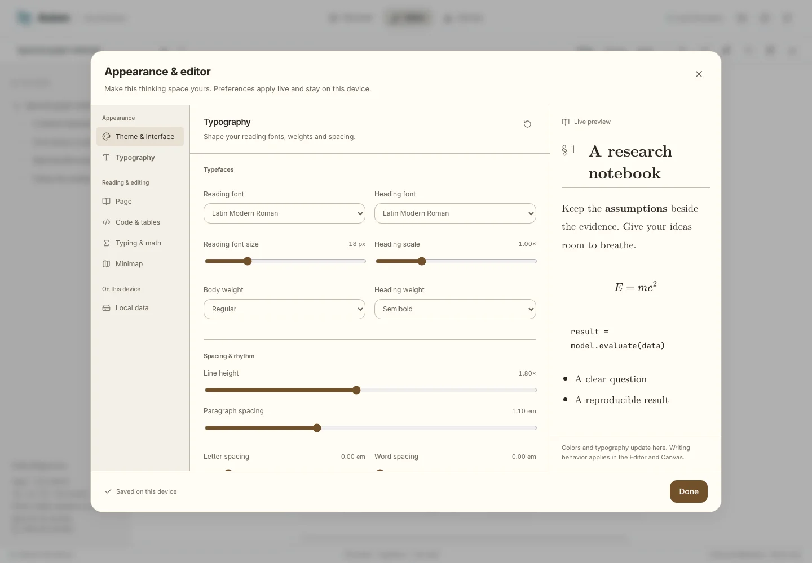

# Interactive, static showcase

[Open the live showcase](https://moleculez.github.io/axiom-notepad/).

The GitHub Pages site offers a feature tour, the **actual Axiom Markdown editor**,
and the **actual Canvas interaction surface**. It is a browser-only demonstration,
not a hosted account service. The wider research, planning and assistant gallery
uses the reviewed fictional Spectral Lab screenshots.

## Try it

The new **mind-map surface** is available in the latest source build, not yet
verified or published by this increment. Choose Mind map for the research fixture
or an existing notebook: edit/search/fold branches, move representable structure,
open Source/Block details and export Markdown/SVG/PNG/PDF/offline HTML. It shares
the editor's local source, undo and persistence, adding no sync/API/provider calls.
ZIP backups retain the profile. See [mind-map limits and acceptance](MINDMAP.md).

- **Editor:** choose a notebook, or create a new one. Write, Source and Read modes
  share canonical Markdown. Try `/`, math, tables, highlighted code, nested lists,
  tasks, images, Mermaid, footnotes, metadata and local note links. The right-hand
  outline uses the production section navigator and resizer: real heading ancestry,
  collapsible branches, Expand/Collapse all, and a current-section indicator that
  follows the caret and reading scroll. Resize with drag/arrow keys or reset with
  double-click/Enter; its width stays on this device. Folding remains available,
  and Appearance controls the minimap. Reset this example is in the editor toolbar.
- **Canvas:** edit rich-text cards, move/resize them, drag connection ports, name
  and group cards, change properties, use templates, arrange selections and undo.
  File cards can reference local notes, images, PDFs, audio, video and other
  canvases. Web cards are explicit external links; loading a web embed can contact
  the linked website and is never necessary to use the demo.
- **Local files:** import Markdown, text, JSON Canvas, images, PDFs and media.
  Binary files live separately from note drafts. Uploads are limited to 100 MB
  each, text/Canvas to 5 MB, and a batch to 30 files. Browser quota may be lower.
  Imported SVGs are download-only; the built-in vector fixture is trusted.
- **Export:** original Markdown, copy, styled self-contained HTML with math,
  diagrams and images, and Print / Save as PDF. Canvas offers JSON Canvas,
  Markdown, SVG, PNG, JPEG, PDF and a portable ZIP. ZIP includes local notes and
  uploads, and can be restored additively through Local files → Import files.
- **Appearance:** Axiom, Paper Research and Technical Slate packs; light, dark
  and system modes; Axiom, Material Tonal, Fluent Studio, Editorial and macOS Studio component styles;
  separate body/heading/code fonts, weights and sizes, line/paragraph/letter/word
  spacing, reading width, equation scale, LaTeX-style numbering, folding guides,
  focus/typewriter behavior, code wrapping/numbers/indentation, table navigation
  and paste, slash commands, delimiter pairing and math completion. The minimap
  has its own side, size, scale, rendering, visibility and marker controls.

## Settings without the clutter

**Appearance** opens one consistent desktop dialog. Its grouped navigation has
seven categories: Theme & interface, Typography, Page, Code & tables, Typing &
math, Minimap and Local data. Up/Down and Home/End navigate the category rail.
Fields scroll independently while the category heading, live preview and
Done button stay visible. Controls retain interface typography even when the
document font changes. The document's own scrollbar sits at the pane edge in
Write, Source and Read modes; its toolbar and word count stay fixed.

The preview toolbar switches between Writing and the shared interactive Interface
specimen without losing either surface's state. Compare native switch/slider,
mixed selection, validation and pending actions in all five treatments. Theme &
interface also controls the UI font/size, density, corner radius and shadows;
reading settings use precise numeric fields, visible units and per-control Reset
alongside the same filled-track sliders as production.

Preferences apply immediately and save locally; **Done closes**, rather than
committing an account-level preference draft. Each category's reset button restores
only its own defaults, leaving other settings and documents unchanged. Full page
width temporarily disables the narrower reading-width control.

**Local data** separates everyday backup/import from destructive reset. Download
a ZIP before clearing. Import is additive and opens the imported document after
closing settings. Clear local demo requires confirmation, restores the examples,
and touches only this demo's guest database, two preference-cache keys and its
local document-panel width. Unrelated workbench preferences remain untouched.

<picture>
  <source media="(prefers-color-scheme: dark)" srcset="assets/showcase/static-settings-dark.webp">
  
</picture>

Visual SVG exports preserve vector connections, but rasterize rich card contents.
Font embedding and clipboard/print support depend on the browser. Use downloads
if clipboard or print is unavailable. Large captures are capped at 120 cards and
32 megapixels, with a separate 64-megapixel card capture budget.

## Privacy and storage boundary

The site has no account, backend, sync provider, AI provider, analytics or service
worker. Drafts, uploads and appearance save to the origin-scoped
`axiom-showcase-v1` IndexedDB database after a short typing debounce. Asset bytes
are stored once as ArrayBuffers for Safari compatibility, not rewritten on each
keystroke. Preview Blobs are recreated locally. Original Markdown contains
stable asset paths; object URLs are used only for current previews.

Browser storage can be cleared, evicted or denied. It is **not a backup** and is
not encrypted by Axiom. If storage fails, the working session remains editable,
an explicit warning appears, and exports still work. Save a ZIP before clearing
local data. Clear local demo touches only this site's guest database; it never
opens, edits or clears a workbench account. Avoid simultaneous edits of the same
local draft in several tabs; this demo has no cross-tab collaboration.

GitHub receives normal static-page and asset requests. Explicit external links or
web-card embeds can contact other sites. Uploaded files are never sent there by
the showcase. No development database, `.env`, private reports, user uploads or
application runtime directories are part of its deployment artifact.

## Develop and verify

From the repository root, with Node 22.16+ (Node 24 in CI):

```bash
npm ci
npm run showcase:dev
```

Open `http://127.0.0.1:3010/axiom-notepad/`. The full application's port 8080 is
unchanged. No `.env`, database, Docker or account is needed for the showcase.

Build and test the actual static output:

```bash
npm run showcase:build
npm run test:showcase
```

Install browser binaries first if needed with `npx playwright install`. Acceptance
uses the `/axiom-notepad/` prefix in Chromium, Firefox and WebKit. It checks cold
routes, asset/worker paths, runtime errors, backend/network containment, source
round trips, local persistence, uploads, file previews, Canvas operations,
portable exports/restore and storage-denied fallback. Results stay in ignored
`data/showcase-results/`.

Fresh README/gallery screenshots use brand-new guest contexts with the bundled
fictional samples. With the built preview running, use
`npm run docs:showcase-assets`; if it runs on port 3011, set
`SHOWCASE_CAPTURE_URL=http://127.0.0.1:3011/axiom-notepad/`. The capture refuses
account services, development/HMR servers and nonlocal URLs. It never reads an
existing browser profile or authenticates to the workbench.

To serve a build yourself:

```bash
npm run showcase:preview
```

If an already-running preview occupies port 3010, use
`SHOWCASE_TEST_URL=http://127.0.0.1:3010/axiom-notepad/ npm run test:showcase`.
For another static host, set `SHOWCASE_BASE=/` (or another trailing-slash prefix)
when building. Hash-based routes survive refresh without SPA rewrite rules.
The output to host is **only** `apps/showcase/dist/`.

## Deployment

[The Pages workflow](../.github/workflows/showcase.yml) builds from `main` on
relevant changes, or via **Actions → Deploy interactive showcase → Run workflow**.
In the repository's **Settings → Pages**, select **GitHub Actions** as the source.
The workflow uses pinned official actions, minimal deployment permissions, a
Node 24 lockfile install, checks and Chromium acceptance before publishing.

Build artifacts are not committed. A failed acceptance/build does not replace the
last successful site. Keep `SHOWCASE_BASE`, the repository name and public links
aligned if the repository is renamed. A custom domain requires its own DNS and
Pages configuration; the default deployment does not modify the production
`notepad.synaiv.com` application.

## Maintenance

`apps/showcase` owns only its shell, local store, samples and local adapters.
`CanvasHost` supplies authenticated services in the workbench or local services
in the showcase; `CanvasSurface`, rich cards and geometry remain shared. The
showcase instantiates `AxiomEditorView` with a local Yjs document and **no provider**.
It imports the exact workbench style cascade, rather than a copied editor theme.

`runtimeAsset()` keeps MathLive fonts and PDF assets prefix-aware. MathJax,
Mermaid, CodeMirror language support, PDF and metadata workers bundle locally.
The build copies only an explicit list of reviewed gallery/brand assets and
licensed vendor fonts/decoders. `THIRD_PARTY_NOTICES.txt` accompanies the site.
Change the shared engine once and run both showcase acceptance and the existing
editor/Canvas regression suites; do not fork a second editor for this demo.

The bundled math worker has a separate, bounded cold-load budget (60 seconds).
A ready handshake starts the existing 1.5-second equation watchdog, so a slow
download cannot be mistaken for runaway TeX. Writing remains usable during
startup. Styled HTML waits for preview readiness instead of silently freezing
still-loading equations. The first visit may be slower than later cached loads.

Acceptance retains strict local/CI timing. An external `SHOWCASE_TEST_URL` uses
one worker and explicit longer cold-network budgets; these do not enable retries
or relax source, export, runtime-error or network-boundary assertions.
