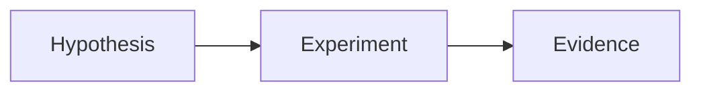

# Research specimen — 多语言研究

Readable text should remain comfortable across light and dark modes, long sessions, and enlarged fonts. This fixture includes **emphasis**, *italic variables*, `inline code`, and a [named link](https://example.org).

Compare the [reference study][study] with the [supporting material][supplement].

[study]: https://example.org/research/replication "A reproducible baseline"
[supplement]: https://example.org/research/supplementary-material-with-a-deliberately-long-path-for-testing-field-overflow

[TOC]

## A useful hypothesis

> [!NOTE] Reproducibility
> Record the seed, assumptions and numerical precision before comparing results.

> Distinguish what the data supports from what the model assumes.
>
> $$\nabla\cdot\mathbf{E}=\frac{\rho}{\varepsilon_0}$$

- [ ] Review the derivation
- [x] Record a reproducible baseline
  - Preserve the assumptions and units.

| Quantity | Meaning | Unit |
| :--- | :--- | ---: |
| $E$ | Energy | J |
| $m$ | Mass | kg |

```python
def mean(values):
    return sum(values) / len(values)
```



$$
\mathcal{L}(\theta)=\frac{1}{N}\sum_{i=1}^{N}\lVert f_\theta(x_i)-y_i\rVert^2
$$

---

An interpretation needs limitations.[^limits]

[^limits]: The sample is finite.

    Display equations and multi-paragraph footnotes must remain readable.

    $$\sigma_{\bar{x}}=\sigma/\sqrt{N}$$
